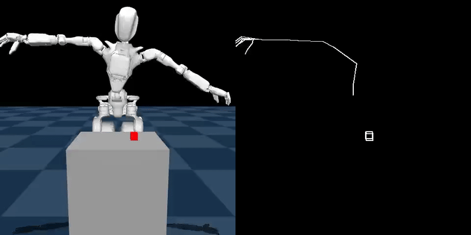
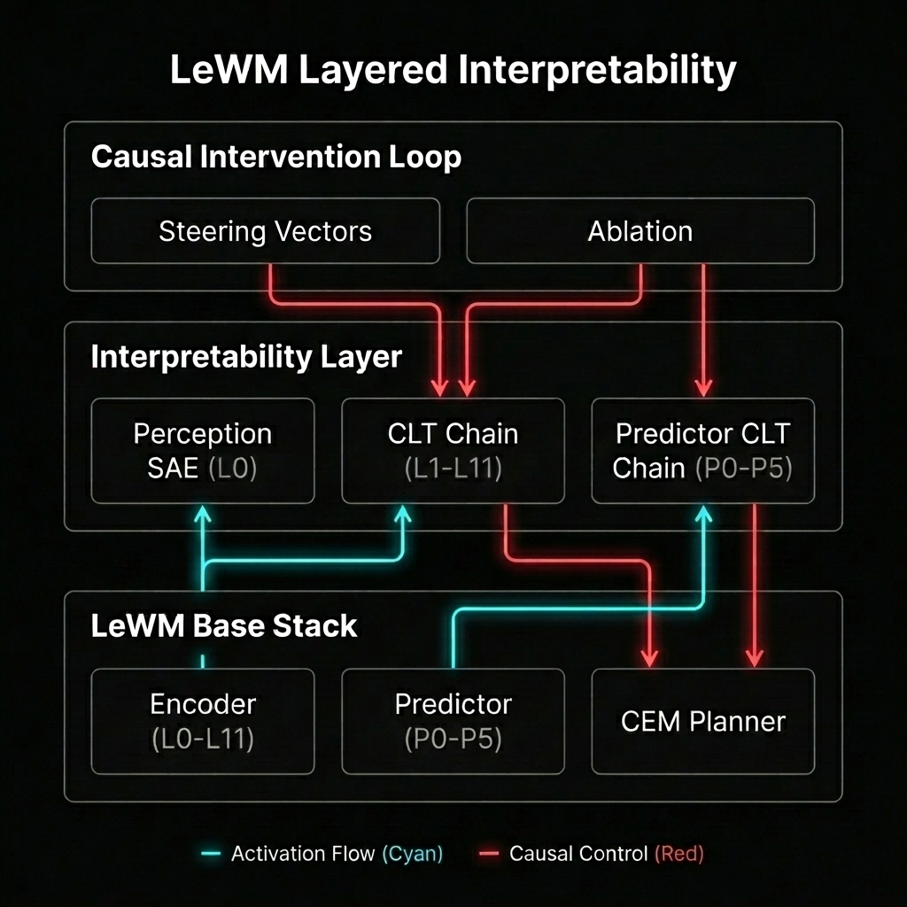

# Le-Probe: Probing LeWM

<div align="center">
  
</div>

Le-Probe is a project meant to analyze and compare **LeWM + MPC** against traditional **Vision-Language-Action (VLA)** policies like GR00T-N1.

My investigation focuses on a high-DoF (32+) manipulation task that require multi-phase coordination, specifically comparing two distinct behavioral strategies: **Grasp** and **Cup**.

## 🚀 Repository Structure

- [**`dataset/`**](./dataset): Teleoperation and high-fidelity data collection (32-frame episodes).
- [**`vla/`**](./vla): GR00T-N1 baselines. Successfully demonstrates both Grasp and Cup behaviors.
- [**`lewm/`**](./lewm): World model training and Oracle MPC. Currently struggles with latent discriminability.
- [**`interpretability/`**](./interpretability): The "Search for the Why"—mechanistic analysis of LeWM failure modes.
- [**`scripts/`**](./scripts): Maintenance, dataset compression, and reward calibration tools.

## 📚 Contents

- **Core Mission:** Explains the work done so far and results.
- **Getting Started:** Installation and setup instructions to reproduce the results.
- **Details:** Each of the sub-folders mentioned above have their own README files providing more details about the process and the results.

## 🔬 Core Mission: VLA vs. LeWM

The project was born from a comparative study of GR00T N1 with LeWM for **picking up a red cube** from the table, but eventually turned into a mechanistic interpretability project for LeWM to understand the latent space in more detail.

### 1. Target Behaviors (Ground Truth)

I've created two datasets aimed at picking up the cube with different behavioural strategies:

<div align="center">
  <table>
    <tr>
      <th>Dataset: Grasp Pattern</th>
      <th>Dataset: Cup Pattern</th>
    </tr>
    <tr>
      <td></td>
      <td></td>
    </tr>
  </table>
</div>

More details are available in [**`dataset/README.md`**](./dataset/README.md).

### 2. VLA Baseline Success (GR00T-N1)

I trained GR00T-N1 to imitate both styles using BC. While the robot isn't able to actually pick up the cube, the behaviour of the model trained with the grasp movement as opposed to the cup movement is clearly visible.

More details available in [**`vla/README.md`**](./vla/README.md).

<div align="center">
  <table>
    <tr>
      <th>VLA: Grasp Execution</th>
      <th>VLA: Cup Execution</th>
    </tr>
    <tr>
      <td></td>
      <td></td>
    </tr>
  </table>
</div>

### 3. LeWM Challenges (The Discriminability Gap)
LeWM, despite training with a large softrank, failed to sufficiently discriminate the goal state from non-goal states in the latent space. Training with multi-view data did show improvements in performance, followed by skeletal priors.

More details available in [**`lewm/README.md`**](./lewm/README.md).

#### Reward Head Intervention

To try and still get some sort of idea of the quality of training, I trained an auxiliary reward head on snapshot data with a broader range of trajectories predict the reward from the latent space. While reward prediction was much better, the MPC solver still didn't manage to actually pick up the cube and instead just got close to it and moved away as you can see in the video below.

#### Single-View RGB

<div align="center">
  <b>LeWM: Grasp Execution</b>
  <hr width="320">
  
</div>

#### Multi-View RGB

Previously, we had only trained the LeWM model with single-view images (`world_center`). Completed another training run while including all the views with late fusion at the encoder side, and got this result where the robot does smash the cube off the table but the only challenge is for the hand to get on top of the table.

<div align="center">
  <b>LeWM: Grasp Execution (Multi-View)</b>
  <hr width="320">
  
</div>

#### Multi-View RGB + Skeletal Priors

- As can be seen with the Multi-View RGB example, once the robot hand is on top of the table it does show a clear intent approaching the cube, but it experiences a fair bit of resistance getting the hand on top of the cube in the first place.
- An intuitive explanation could be that the model still ends up trying to learn about the position of joints that aren't really that important for the motion.
- To improve the behaviour, skeletal priors were added to the training data that solely focused on the joints that are actually important for picking up the cube as the 4th channel after RGB.

<div align="center">
  <b>Skeletal Priors</b>
  <hr width="100%">
  
</div>

The model trained doesn't experience the same kind of resistance faced when we were relying on the skeletal and it also somewhat attempted the pickup movement albeit a bit too rapidly and smashed the cube off the table after 2 failed attempts.

<div align="center">
  <b>LeWM: Grasp Execution (Multi-View + Skeletal Priors)</b>
  <hr width="320">
  
</div>

It still doesn't actually pick up the cube, we need to find further ways of learning all 4 sub-phases of movement needed for the task separately.

### 4. Interpretability

#### Next Steps

Given how the behaviour differs between different kinds of training data, it makes sense to try and get a better idea of what the model has ended up learning.

More details are available in [**`interpretability/README.md`**](./interpretability/README.md).

#### Latent Topology Audit

Dimensionality reduction (PCA, t-SNE, UMAP) to diagnose manifold fragmentation and MPC search failures.

| Type | 3D PCA | 3D t-SNE | 3D UMAP |
| :--- | :---: | :---: | :---: |
| **Single-View** |  |  |  |
| **Multi-View** |  |  |  |
| **Multi-View + Skeletal Priors** |  |  |  |

#### Neuronpedia

To understand why LeWM struggles with goal discrimination, I am working with a fork of [neuronpedia](https://github.com/hijohnnylin/neuronpedia) [here](https://github.com/vedpatwardhan/neuronpedia).

##### Architecture

We use a full-stack attribution engine that probes every layer of the Encoder and Predictor.

<div align="center">
  
  <p><i>LeWM Interpretability: Global Causal Tracing from Pixels to Reward.</i></p>
</div>

##### Results

High-level decision hubs (L11) draw raw spatial anchors directly from early sensory layers (L0/L1) via 10+ layer skip connections.

<div align="center">
  
  <p><i>The Le-Probe Dashboard: Mapping the L0 $\rightarrow$ L11 skip connections.</i></p>
</div>

*   **Neuronpedia Dashboard**: Hierarchical circuit tracing from pixels to reward probability (L0 $\rightarrow$ L11 skip connections).
    *   **Visual Patch Audit**: Mapping feature activations back to specific image patches with green-box highlighting.
    *   **Integrated Gradients**: Tracing the exact causal path from pixels to Success Probability.
    *   **Directional Filtering**: Using a **Min-K Union** filter to isolate the most critical causal circuits.

## 🛠 Getting Started

### 1. Installation
```bash
# Clone with submodules (includes the custom Neuronpedia fork)
git clone --recursive https://github.com/vedpatwardhan/le-probe.git
cd le-probe && python3 -m venv .venv && source .venv/bin/activate
pip install -r requirements.txt
```

### 2. Infrastructure Setup
The mechanistic dashboard requires a local Dockerized Neuronpedia instance.

```bash
# Start the Dashboard (Docker)
cd interpretability/neuronpedia
make up

# Start the Attribution Proxy
# Tunnels requests from the dashboard to the model engine
.venv/bin/python interpretability/dashboard/neuronpedia_server.py
```

### 1. Data Collection & Datasets

I have published three core datasets used for the above results:
- [**`gr1_pickup_grasp`**](https://huggingface.co/datasets/vedpatwardhan/gr1_pickup_grasp): Precision "pinch" grasp trajectories.
- [**`gr1_pickup_cup`**](https://huggingface.co/datasets/vedpatwardhan/gr1_pickup_cup): Robust "surrounding" containment trajectories.
- [**`gr1_reward_pred`**](https://huggingface.co/datasets/vedpatwardhan/gr1_reward_pred): Multi-behavioral data used to train the Reward Head.
- [**`gr1_reward_pred_v2`**](https://huggingface.co/datasets/vedpatwardhan/gr1_reward_pred_v2): Multi-view version of `gr1_reward_pred`.

Optionally, if you'd like to record new datasets you can use the following:

#### Data Collection
```bash
# Start the Rerun server
rerun

# Start Sim Server
.venv/bin/python dataset/simulation_teleop.py

# Start Dashboard
streamlit run dataset/teleop_ui.py
```

#### Dataset Upload
```bash
.venv/bin/python dataset/upload_dataset.py --repo_id <>
```

#### Skeletal Priors

1. **Generate Priors For Main Dataset**: Pulls the video dataset used to train the LeWM and makes in-place changes.
  ```bash
  .venv/bin/python dataset/skeleton/generate_priors.py vedpatwardhan/gr1_pickup_grasp
  ```

2. **Generate Priors For Reward Dataset**: Pulls the reward prediction dataset used to fine-tune the reward head and makes in-place changes.
  ```bash
  .venv/bin/python dataset/skeleton/generate_reward_priors.py vedpatwardhan/gr1_reward_pred
  ```

### 2. VLA (GR00T-N1)

#### Training

The model was trained using [**`vla/GR00T_N1_BC.ipynb`**](vla/GR00T_N1_BC.ipynb)

To run the stabilized VLA policy in simulation, the model weights/configs are available at the following folders:

| Type of Movement | Google Drive Link |
| --- | --- |
| **Grasp** | [pretrained_model](https://drive.google.com/drive/folders/1077_msVzs_8AQPaEbDm6XPiq8T_hxirp?usp=sharing) |
| **Cup** | [pretrained_model](https://drive.google.com/drive/folders/1f5p6-5p6_20PpfbONcq-n5T1P7DhHfBw?usp=sharing) |


#### Inference

1. **Inference Server**: Was run using [**`vla/GR00T_N1_E2E.ipynb`**](vla/GR00T_N1_E2E.ipynb) using a Pinggy tunnel.
   ```bash
   .venv/bin/python vla/gr00t_server.py --weights <path to pretrained_model folder>
   ```

2. **Simulation Host**:
   ```bash
   .venv/bin/python vla/simulation_vla.py --host <host> --port <port> --chunks <num_chunks>
   ```

### 3. LeWM + CEM/MPC

The model is trained using [**`lewm/LeWM_Training.ipynb`**](lewm/LeWM_Training.ipynb). The single-view training of the model was done in the `GR-1 Pickup Grasp` section and the multi-view training was done in the `GR-1 Pickup Grasp (Multi-View)` section.

Following the training, all goal states in the dataset were harvested in the latent space using [**`lewm/harvest_goals.py`**](lewm/harvest_goals.py) to save inference time.

**Pre-trained Artifacts**:

| Version | Model Checkpoint | Goal Gallery |
| :--- | :--- | :--- |
| **Single-View** | [`gr1_reward_tuned_v2.ckpt`](https://drive.google.com/file/d/1dPp-yuSEKMywKPH1mzKT4m7f7Rq5ak7A/view?usp=sharing) | [`goal_gallery.pth`](https://drive.google.com/file/d/1KDxrZVbrlB2wDDPJAQfHIZxZi48ZhN8U/view?usp=sharing) |
| **Multi-View** | [`gr1_reward_tuned_v2.ckpt`](https://drive.google.com/file/d/1pGMMicqYL_Z8GCS1TOe2A_kAAJQLV3qd/view?usp=sharing) | [`goal_gallery.pth`](https://drive.google.com/file/d/1gYk_P9Godif20boD64M8epR5xSSSxugn/view?usp=sharing) |
| **Multi-View + Skeletal Priors** | [`gr1_reward_tuned_v2.ckpt`](https://drive.google.com/file/d/1tiN-awjiMl0oUy8uLE9JT0850QQOPCUI/view?usp=sharing) | [`goal_gallery.pth`](https://drive.google.com/file/d/1R9uuqpd1yb7t7-NwuvEq7VrOuI6wI152/view?usp=sharing) |

#### Inference

1. **Inference Server**: Was run using [**`lewm/LEWM_E2E.ipynb`**](lewm/LEWM_E2E.ipynb) using a Pinggy tunnel.
   ```bash
   # For Single-View
   .venv/bin/python lewm/lewm_server.py --model gr1_reward_tuned_v2.ckpt --gallery goal_gallery.pth

   # For Multi-View
   .venv/bin/python lewm/lewm_server.py --model gr1_reward_tuned_v2.ckpt --gallery goal_gallery.pth --multi_view

   # For Multi-View + Skeletal Priors
   .venv/bin/python lewm/lewm_server.py --model gr1_reward_tuned_v6.ckpt --gallery goal_gallery.pth --multi_view --use_skeleton
   ```

2. **Simulation Host**:
   ```bash
   # For Single-View
   .venv/bin/python lewm/simulation_lewm.py --host <host> --port <port>

   # For Multi-View
   .venv/bin/python lewm/simulation_lewm.py --host <host> --port <port> --multi_view

   # For Multi-View + Skeletal Priors
   .venv/bin/python lewm/simulation_lewm.py --host <host> --port <port> --multi_view --use_skeleton
   ```

### 4. Interpretability

#### Train CLT

The activations and weights are available here:

| Type | Google Drive Link |
| --- | --- |
| Activations | [activations_granular](https://drive.google.com/drive/folders/1wAUUsT88b458OUQ6qdTsIe8hCzuinNc4?usp=sharing) |
| Weights | [transcoder_weights_residual](https://drive.google.com/drive/folders/1LRxPy4A02ZTanGnQmsosvC_oxq-8AHM6?usp=sharing) |

Optionally, the activations can be harvested with the following steps, also covered in [**`LeWM_Interpretability.ipynb`**](./LeWM_Interpretability.ipynb)

1. **Harvest the Activations**: Stores activations for all layers of the LeWM with all the data
```bash
.venv/bin/python interpretability/transcoders/harvest_activations.py \
    --model gr1_reward_tuned_v2.ckpt \
    --output activations_granular \
    --workers 4
```

2. **Audit the Harvest**: Just to check if the harvest worked
```bash
.venv/bin/python interpretability/transcoders/audit_harvest.py \
    --model gr1_reward_tuned_v2.ckpt \
    --dir activations_granular
```

3. **Train the CLT**: The [`batch_train.sh`](interpretability/transcoders/batch_train.sh) script trains the CLT for all layers using the harvested activations.
```bash
bash interpretability/transcoders/batch_train.sh
```

#### Neuronpedia Visualization

1. **Start the Neuronpedia Dashboard (Docker)**: This spins up our fork of neuronpedia.
```bash
cd interpretability/neuronpedia
make webapp-localhost-dev
```

2. **Start the Engine (Colab)**: The engine runs on colab using a Pinggy tunnel
```bash
.venv/bin/python interpretability/dashboard/engine.py \
    --repo vedpatwardhan/gr1_pickup_grasp \
    --meta activations_granular/encoder_L0.json \
    --model gr1_reward_tuned_v2.ckpt \
    --transcoders transcoder_weights_residual \
    --min-k 10
```

3. **Start the Neuronpedia Dashboard Proxy (Local)**: The proxy runs locally and tunnels requests from the dashboard to the engine
```bash
.venv/bin/python interpretability/dashboard/neuronpedia_server.py
```

4. **Generate Graphs**: Uses the server to pre-compute the graphs for certain states in the dataset
```bash
.venv/bin/python interpretability/dashboard/regenerate_graphs.py
```

#### Latent Manifold Topology
Analyze the internal "map" of the latent space to diagnose planning failures.
| Type | 3D PCA | 3D t-SNE | 3D UMAP |
| :--- | :---: | :---: | :---: |
| **Single-View** |  |  |  |
| **Multi-View** |  |  |  |

0. **Latest Manifolds:**
| Version | Interactive Manifold (UMAP) |
| :--- | :--- |
| **Single-View** | [manifold_data.pt](https://drive.google.com/file/d/17f2l3ebzrX0chu5Zy0GiWEYqGZ-M0CyK/view?usp=sharing) |
| **Multi-View** | [manifold_data.pt](https://drive.google.com/file/d/1ix3_ISc80CX91RWKafP0pV8ZA9RlO49f/view?usp=sharing) |

1. **Harvest Latents**:
```bash
# Multi-View Harvest
.venv/bin/python interpretability/manifold/harvest_manifold.py --episodes 200 --multi_view

# Single-View Harvest
.venv/bin/python interpretability/manifold/harvest_manifold.py --episodes 200
```

2. **Visualize Latent Topology**:
```bash
.venv/bin/python interpretability/manifold/visualize_manifold.py --method umap --output manifold_3d_umap.html
```

---
*Developed by Ved Patwardhan.*
