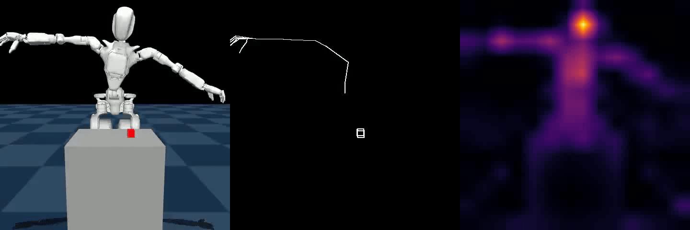

# Dataset: Collection, Priors, and Probe Inputs

This module defines how data is created and augmented for the Le-Probe protocol.

## Role in the Paper Narrative

- Produces 32-frame episodes for the cube-pick task.
- Builds the inductive priors used in the representation ladder:
  - skeletal priors (4th channel),
  - DINOv3 waypoint priors.
- Generates probe-ready assets for static workspace audits.

## Key Components

- [`teleop_ui.py`](./teleop_ui.py): Streamlit control panel for recording.
- [`simulation_teleop.py`](./simulation_teleop.py): teleop backend server.
- [`lerobot_manager.py`](./lerobot_manager.py): LeRobot episode writer + metadata handling.
- [`upload_dataset.py`](./upload_dataset.py): optional dataset upload utility.
- [`skeleton/`](./skeleton): skeletal and DINOv3 prior generation tools.
- [`task_workspace_probe/`](./task_workspace_probe): static probe pipeline.

## Dataset IDs

- `gr1_pickup_grasp`
- `gr1_reward_pred`
- `gr1_reward_pred_v2`

## Dataset Links

- `gr1_pickup_grasp`: [Google Drive folder](https://drive.google.com/drive/folders/1yYMT7J_eRkQmXDq3tcisNd4kRSWeTI40?usp=sharing)
- `gr1_reward_pred`: [Google Drive folder](https://drive.google.com/drive/folders/1QWra9dRJ9aceUqOpmj56OG8SaVUCVr-g?usp=sharing)
- `gr1_reward_pred_v2`: [Google Drive folder](https://drive.google.com/drive/folders/1iwz_1LeEi4vbMWDeIXU_Pb6tVxDqcbNE?usp=sharing)

## Setup

```bash
cd le-probe
python3 -m venv .venv
source .venv/bin/activate
pip install -r requirements.txt
```

## Data Collection (Optional)

```bash
# Terminal 1
rerun

# Terminal 2
.venv/bin/python dataset/simulation_teleop.py

# Terminal 3
streamlit run dataset/teleop_ui.py
```

## Priors Workflow

### Skeletal Priors

```bash
.venv/bin/python dataset/skeleton/generate_priors.py gr1_pickup_grasp
.venv/bin/python dataset/skeleton/generate_reward_priors.py gr1_reward_pred
.venv/bin/python dataset/skeleton/audit_priors.py --repo_id gr1_reward_pred_v2 --frames dataset_skel_frames
```

### DINOv3 Waypoints

```bash
.venv/bin/python dataset/skeleton/generate_dino_priors.py gr1_pickup_grasp
```

## Visual Examples

<div align="center">
  
  
</div>

<div align="center">
  
</div>

<div align="center">
  
</div>

## Static Workspace Probes

See [`task_workspace_probe/README.md`](./task_workspace_probe/README.md) for the 500-point static-probe workflow.
