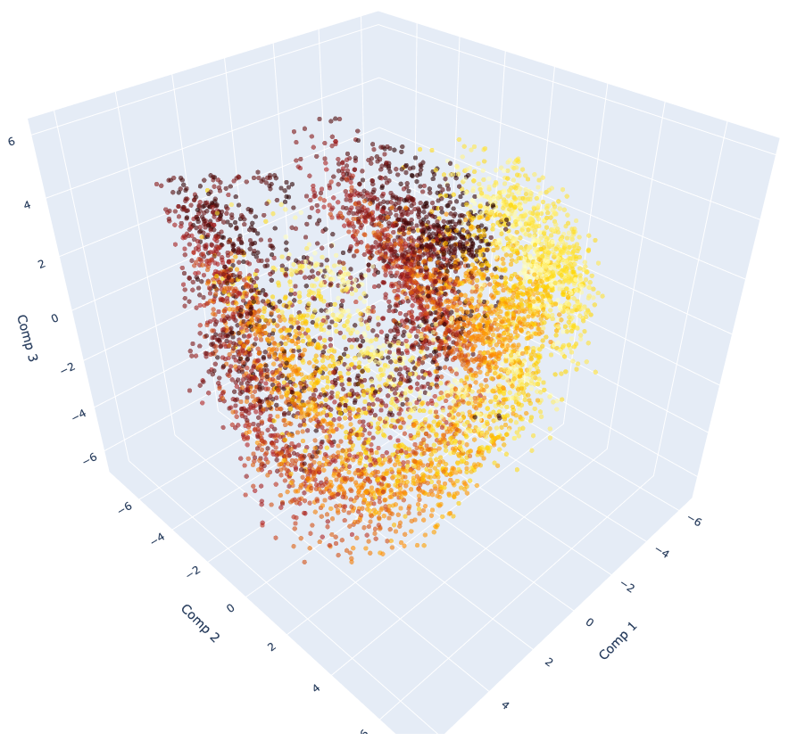
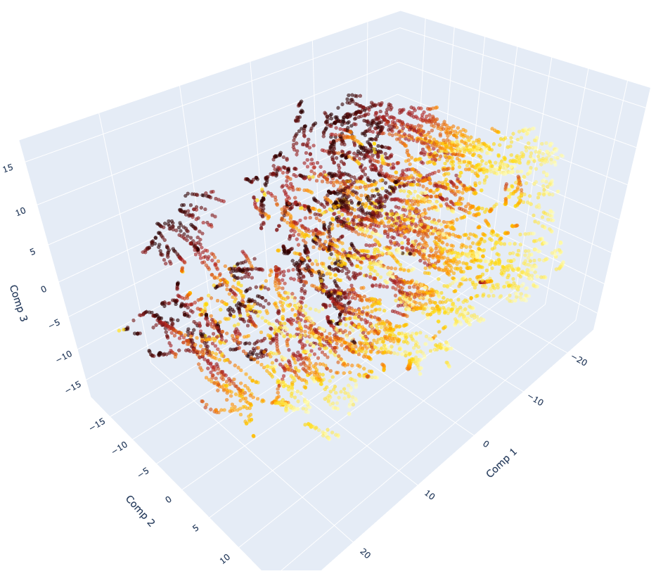
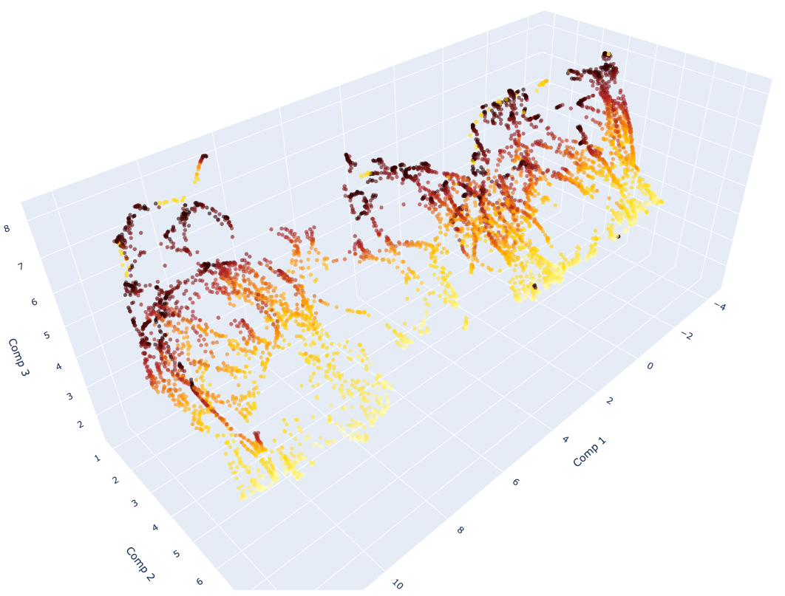

# Interpretability: Topology, Static Probes, and Mechanistic Audits

This module covers the analysis side of Le-Probe: why planning behavior changes across representation variants.

## Protocol Coverage

- **Training-topology audits:** PCA/t-SNE/UMAP on trajectory latents.
- **Static probes:** workspace-labeled latent projections on fixed probe snapshots.
- **Mechanistic audits:** CLTs and Neuronpedia-based attribution traces.

## Submodules

- [`manifold/`](./manifold): latent harvesting and dimensionality reduction.
- [`transcoders/`](./transcoders): activation harvest, audits, and CLT training.
- [`dashboard/`](./dashboard): bridge code for Neuronpedia visualization.
- [`LeWM_Interpretability.ipynb`](./LeWM_Interpretability.ipynb): notebook pipeline.

## Training-Manifold Snapshot

| Variant | 3D PCA | 3D t-SNE | 3D UMAP |
| :--- | :---: | :---: | :---: |
| **Single-View RGB** |  |  |  |
| **Multi-View RGB** |  |  |  |
| **Multi-View RGB + Skeletal Priors** |  |  |  |
| **Multi-View RGB + Skeletal Priors + DINOv3 Waypoints** |  |  |  |

## Static Probe Results

- **Primary takeaway:** static latent organization improves consistently across variants, with best separation in `Multi-View RGB + Skeletal Priors` and `Multi-View RGB + Skeletal Priors + DINOv3 Waypoints`.
- **Output locations:** `workspace_visualization/lateral_table_region/`, `workspace_visualization/distance_to_cube/`, `workspace_visualization/pose_clusters/`.

## Setup

```bash
cd le-probe
python3 -m venv .venv
source .venv/bin/activate
pip install -r requirements.txt
```

## CLT Workflow (Minimal)

```bash
# 1) Harvest activations
.venv/bin/python interpretability/transcoders/harvest_activations.py \
  --model <ckpt> \
  --output_dir activations_granular_multiview_skeleton_dino \
  --multi_view --use_skeleton --use_dino --workers 4

# 2) Audit
.venv/bin/python interpretability/transcoders/audit_harvest.py \
  --model <ckpt> \
  --dir activations_granular_multiview_skeleton_dino \
  --multi_view --use_skeleton --use_dino
```

## Neuronpedia Visualization

### Static probes (label-scheme exploration)

**Scope:** encoder CLT features only (`encoder_L0`–`encoder_L11`). Tier-A differential
scores are on `encoder_L0` probe embeddings. Full graph JSONs may still show predictor /
reward / DINO nodes; `*.nodes.md` sidecars list **encoder features to click** only.

**Colab / local artifacts (no `gr1_pickup_grasp` for this path):** probe bundle + latents,
four checkpoint trees (`.ckpt` + `transcoder_weights_residual/`). Training teleop dataset
is not loaded for playbook or `run_probe_attribution_graphs.py`.

```bash
cd le-probe

# 1) Shortlist probes per lateral / distance / pose × variant
.venv/bin/python interpretability/transcoders/build_neuronpedia_probe_playbook.py --pilot

# 2) Precompute IG attribution graphs + node recommendations (no UI yet)
.venv/bin/python interpretability/dashboard/run_probe_attribution_graphs.py \
  --variant multiview_skeleton --scheme distance

# Each graph gets sidecars:
#   distance_at_cube_canonical_pid127.json
#   distance_at_cube_canonical_pid127.nodes.json   # ranked CLT features to click
#   distance_at_cube_canonical_pid127.nodes.md     # human-readable brief

# 3) Optional: re-rank nodes from existing graphs only
.venv/bin/python interpretability/dashboard/recommend_neuronpedia_nodes.py \
  workspace_visualization/attribution_graphs/multiview_skeleton/

# 4) Neuronpedia UI (probe mode engine)
cd interpretability/neuronpedia && make webapp-localhost-dev

.venv/bin/python interpretability/dashboard/engine.py \
  --dataset-source probes \
  --probe-bundle datasets/workspace_probe_grasp/workspace_probe_bundle.pt \
  --meta activations_granular_multiview_skeleton/encoder_L0.json \
  --model checkpoints/lewm_grasp_multiview_skeleton/gr1_reward_tuned_v2.ckpt \
  --transcoders checkpoints/lewm_grasp_multiview_skeleton/transcoder_weights_residual \
  --multi_view --use_skeleton --min-k 15

# In Neuronpedia, use prompt probe:<probe_id> (see *.nodes.md for which features to open)
.venv/bin/python interpretability/dashboard/neuronpedia_server.py
```

Variant flags and checkpoint paths: `interpretability/dashboard/variant_profiles.yaml`.

### Training episodes (legacy)

```bash
cd interpretability/neuronpedia
make webapp-localhost-dev

.venv/bin/python interpretability/dashboard/engine.py \
  --repo gr1_pickup_grasp \
  --meta activations_granular_multiview_skeleton/encoder_L0.json \
  --model <ckpt> \
  --transcoders <transcoder_dir> \
  --multi_view --use_skeleton --min-k 10

.venv/bin/python interpretability/dashboard/neuronpedia_server.py
```

## Current Mechanistic Artifact

<div align="center">
  
</div>

## Supplementary Artifacts

- Transcoder weights (Single-View RGB): [Google Drive folder](https://drive.google.com/drive/folders/13Aw6iF1PfWqBR2CRh3A-wjqub6DP_Ty2?usp=sharing)
- Transcoder weights (Multi-View RGB): [Google Drive folder](https://drive.google.com/drive/folders/12vq8hnySCqt6Z6rYGioz-ghjoFIdvcCv?usp=sharing)
- Transcoder weights (Multi-View RGB + Skeletal Priors): [Google Drive folder](https://drive.google.com/drive/folders/1TXS4sObpbvBxI-GUrdoicY1hNXPh_c1Q?usp=sharing)
- Transcoder weights (Multi-View RGB + Skeletal Priors + DINOv3 Waypoints): [Google Drive folder](https://drive.google.com/drive/folders/1Kak0qNzLPJr_jmDWCJMLu5ss4eg1Dsvb?usp=sharing)

### Manifold Harvest Dumps

- Single-View RGB: [manifold_data.pt](https://drive.google.com/file/d/18us_mOIVa2QgIP2VoISC-wpVzI7moCyV/view?usp=sharing)
- Multi-View RGB: [manifold_data.pt](https://drive.google.com/file/d/1lqcmNQGiiECSPG4CM1h2c1S3JxwUQ_mP/view?usp=sharing)
- Multi-View RGB + Skeletal Priors: [manifold_data.pt](https://drive.google.com/file/d/19lxR0rJ-Oo7drudU_NyXQL3_cvlOGIcO/view?usp=sharing)
- Multi-View RGB + Skeletal Priors + DINOv3 Waypoints: [manifold_data.pt](https://drive.google.com/file/d/1Xhc9kMDilG3TpBA8GdDFLF4l7oe4j3Wz/view?usp=sharing)
