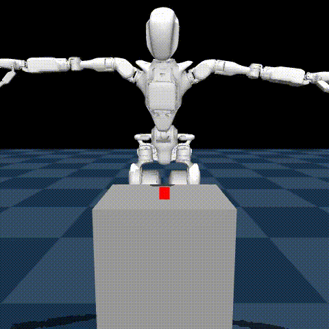
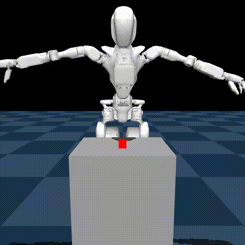
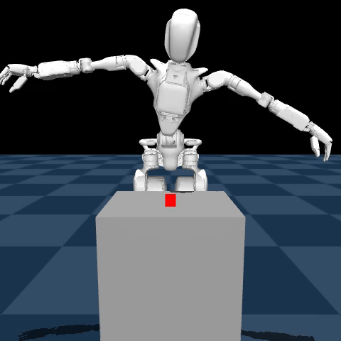

# LeWM: World Model Training and Latent MPC

This module contains the LeWorldModel training and planning stack used for:

`Single-View RGB -> Multi-View RGB -> Multi-View RGB + Skeletal Priors -> Multi-View RGB + Skeletal Priors + DINOv3 Waypoints`

## Variant Flags

| Variant | Runtime Flags |
| :--- | :--- |
| Single-View RGB | *(none)* |
| Multi-View RGB | `--multi_view` |
| Multi-View RGB + Skeletal Priors | `--multi_view --use_skeleton` |
| Multi-View RGB + Skeletal Priors + DINOv3 Waypoints | `--multi_view --use_skeleton --use_dino` |

## What This Module Covers

- JEPA-based training for world-model dynamics.
- Reward-head tuning for planning signal calibration.
- Goal-latent gallery harvesting (`z_g` bank for MPC).
- Latent CEM/MPC serving and simulation rollouts.

## Core Files

- [`LeWM_Training.ipynb`](./LeWM_Training.ipynb): experiment notebook for model + reward training.
- [`train_lewm.py`](./train_lewm.py): training entrypoint.
- [`tune_reward_head.py`](./tune_reward_head.py): reward refinement with snapshot data.
- [`harvest_goals.py`](./harvest_goals.py): saves latent goal gallery.
- [`lewm_server.py`](./lewm_server.py): planner server (`POST /plan`).
- [`simulation_lewm.py`](./simulation_lewm.py): MuJoCo rollout host.
- [`diagnose_mpc.py`](./diagnose_mpc.py): CEM trajectory diagnostics.
- [`skeleton/`](./skeleton): 4th-channel skeletal training/tuning path.

## Variant Deltas

| Variant | Runtime Flags | Extra Data Signal |
| :--- | :--- | :--- |
| Single-View RGB | *(none)* | `world_center` |
| Multi-View RGB | `--multi_view` | 5 camera streams |
| Multi-View RGB + Skeletal Priors | `--multi_view --use_skeleton` | tiled kinematic channel |
| Multi-View RGB + Skeletal Priors + DINOv3 Waypoints | `--multi_view --use_skeleton --use_dino` | phase waypoint targets |

## Setup

```bash
cd le-probe
python3 -m venv .venv
source .venv/bin/activate
pip install -r requirements.txt
```

## Quick Workflow

Primary reference notebooks for experiment reproduction:

- [`LeWM_Training.ipynb`](./LeWM_Training.ipynb): canonical training and checkpoint workflow.
- [`LeWM_E2E.ipynb`](./LeWM_E2E.ipynb): canonical end-to-end planning/inference workflow.

Notebook-aligned CLI flow (mirrors the sequence in `LeWM_Training.ipynb` and `LeWM_E2E.ipynb`):

```bash
# 0) From repo root
cd le-probe
source .venv/bin/activate

# 1) Baseline training (Single-View RGB)
.venv/bin/python lewm/train_lewm.py data.dataset.repo_id="gr1_pickup_grasp"

# 2) Multi-View RGB + Skeletal Priors data prep
.venv/bin/python dataset/skeleton/generate_priors.py gr1_pickup_grasp
.venv/bin/python dataset/skeleton/verify_tiling.py gr1_pickup_grasp/videos/observation.images.world_center_tiled/chunk-000/file-000.mp4

# 3) Train with skeletal priors
.venv/bin/python lewm/skeleton/trainer.py \
  --repo_id gr1_pickup_grasp \
  --multi_view --use_skeleton

# 4) Add DINOv3 waypoints + fused cache
.venv/bin/python dataset/skeleton/generate_dino_priors.py gr1_pickup_grasp
.venv/bin/python dataset/skeleton/cache_fused_dataset.py gr1_pickup_grasp
.venv/bin/python dataset/skeleton/verify_cache.py gr1_pickup_grasp

# 5) Train Multi-View RGB + Skeletal Priors + DINOv3 Waypoints
.venv/bin/python lewm/skeleton/trainer.py \
  --repo_id gr1_pickup_grasp \
  --multi_view --use_skeleton --use_dino

# 6) Reward-head tuning
.venv/bin/python lewm/tune_reward_head.py \
  --repo_id gr1_reward_pred

# 7) Prepare reward dataset priors + audit
.venv/bin/python dataset/skeleton/generate_reward_priors.py \
  --repo_id gr1_reward_pred_v2
.venv/bin/python dataset/skeleton/audit_priors.py \
  --repo_id gr1_reward_pred_v2 --frames dataset_skel_frames

# 8) Optional calibrator/tuner pass on tuned checkpoint
.venv/bin/python lewm/skeleton/tuner.py \
  --ckpt <reward_tuned_ckpt> \
  --repo_id gr1_reward_pred_v2

# 9) Harvest goal gallery for MPC
.venv/bin/python lewm/harvest_goals.py

# 10) Optional MPC diagnostic sweep before serving
.venv/bin/python lewm/diagnose_mpc.py \
  --model <ckpt> \
  --gallery goal_gallery.pth \
  --multi_view --use_skeleton --use_dino

# 11) Start planner server (LeWM_E2E.ipynb reference)
.venv/bin/python lewm/lewm_server.py \
  --model <ckpt> \
  --gallery goal_gallery.pth \
  --multi_view --use_skeleton --use_dino

# 12) Run simulation client
.venv/bin/python lewm/simulation_lewm.py \
  --base_url https://<id>.ngrok-free.app \
  --multi_view --use_skeleton --use_dino
```

## Rollout Artifacts

<div align="center">
  
  
  
  
</div>

## Notes

- Default dataset IDs are anonymized in configs/scripts.
- This module focuses on representation and planning behavior, not end-task success guarantees.

## Pretrained Artifacts (Supplementary Storage)

| Variant | Model Checkpoint | Goal Gallery |
| :--- | :--- | :--- |
| Single-View RGB | [gr1_reward_tuned_v2.ckpt](https://drive.google.com/file/d/1L0RE9V647-JduSCJ40y1TEI-N8MIO62D/view?usp=sharing) | [goal_gallery.pth](https://drive.google.com/file/d/1CA9KxgnvHeJjslUOKoaxvmPV4TnhzWeS/view?usp=sharing) |
| Multi-View RGB | [gr1_reward_tuned_v2.ckpt](https://drive.google.com/file/d/1VEEAa4vWcnqQN1PMK5422FK_1QJ0Hu74/view?usp=sharing) | [goal_gallery.pth](https://drive.google.com/file/d/1ntMBODRRDP-bZDFUrbxli-3WxT4zveAv/view?usp=sharing) |
| Multi-View RGB + Skeletal Priors | [gr1_reward_tuned_v6.ckpt](https://drive.google.com/file/d/1W2UUco30AJE1ygjeGjRK1jFWB7PvGXEx/view?usp=sharing) | [goal_gallery.pth](https://drive.google.com/file/d/1YEsGDwT1AvWetxS7vbLGL94xTOEDJtyP/view?usp=sharing) |
| Multi-View RGB + Skeletal Priors + DINOv3 Waypoints | [gr1_reward_tuned_v1.ckpt](https://drive.google.com/file/d/1Yt1Q60yvvDPPFE3JjICq48ocOycUALGT/view?usp=sharing) | [goal_gallery.pth](https://drive.google.com/file/d/1jpApbuPUHIAb3Ae87VzFAvFBVhVZr3X6/view?usp=sharing) |
